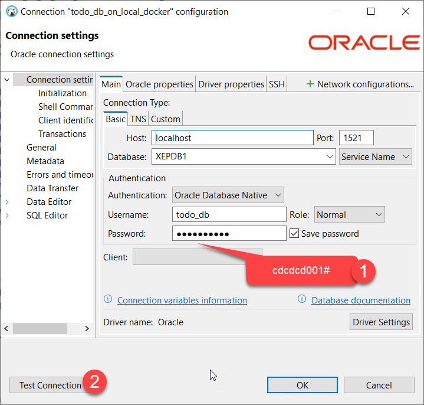

# I want to docker run with oracle ex21

---

```bash
## Making a volume, ora-db
$ docker volume create ora-db
## Pull oracle-express:21.3.0-xe image from docker-hub
$ docker pull container-registry.oracle.com/database/express:21.3.0-xe

## list all images on my local docker desktop
$ docker images
REPOSITORY                                       TAG         IMAGE ID       CREATED         SIZE
soromiso/mariadb                                 latest      89ac8acafb15   2 months ago    454MB
container-registry.oracle.com/database/express   21.3.0-xe   dcf137aab02d   20 months ago   15.2GB

## rename the image name with oracle-xe
$ docker tag container-registry.oracle.com/database/express:21.3.0-xe:21.3.0-xe oracle-xe

## list all images on my local docker desktop
$ docker images
REPOSITORY         TAG       IMAGE ID       CREATED         SIZE
soromiso/mariadb   latest    89ac8acafb15   2 months ago    454MB
oracle-xe          latest    dcf137aab02d   20 months ago   15.2GB

## docker container run with some options
$ docker run -d --name oracle-xe -p 1521:1521 -p 5500:5500 -e ORACLE_PWD=cdcdcd001! -v ora-db:/opt/oracle/oradata oracle-xe

## list all docker containers on my local docker desktop
$ docker ps -a
CONTAINER ID   IMAGE              COMMAND                  CREATED          STATUS                            PORTS                                            NAMES
92044c07412b   oracle-xe          "/bin/bash -c $ORACL…"   26 seconds ago   Up 5 seconds (health: starting)   0.0.0.0:1521->1521/tcp, 0.0.0.0:5500->5500/tcp   oracle-xe        
394e4fe9c650   soromiso/mariadb   "docker-entrypoint.s…"   4 days ago       Up 4 hours                        0.0.0.0:3307->3306/tcp                           mariadb_container

```

# Create the todo_db schema (user)
```bash
$ docker exec -it oracle-xe bash
$ sqlplus sys/cdcdcd001\!@//localhost:1521/XEPDB1 as sysdba # password has ! character, so Escape the ! with a backslash
SQL*Plus: Release 19.7.0.2.0 Production

# By default, Oracle passwords (unquoted) may only include letters, digits, and the special characters _, $, and #. 
# For example, change your password to something like:
CREATE USER todo_db IDENTIFIED BY cdcdcd001#;
ALTER USER todo_db QUOTA UNLIMITED ON USERS;
GRANT CONNECT, RESOURCE TO todo_db;
EXIT

```

# Connecting from DBeaver


```sql
## Create tables
-- 1) Create the user_profiles table
CREATE TABLE user_profiles (
  id                  NUMBER GENERATED BY DEFAULT ON NULL AS IDENTITY 
                         (START WITH 1 INCREMENT BY 1) 
                         NOT NULL,
  email               VARCHAR2(100 CHAR)      NOT NULL,
  name                VARCHAR2(100 CHAR)      NOT NULL,
  password            VARCHAR2(100 CHAR)      NOT NULL,
  profile_image_url   VARCHAR2(100 CHAR),
  phone               VARCHAR2(100 CHAR),
  address             VARCHAR2(100 CHAR),
  role                VARCHAR2(100 CHAR),
  bio                 VARCHAR2(100 CHAR),
  created_at          TIMESTAMP               DEFAULT SYSTIMESTAMP NOT NULL,
  updated_at          TIMESTAMP               DEFAULT SYSTIMESTAMP NOT NULL,
  CONSTRAINT user_profiles_pk PRIMARY KEY (id),
  CONSTRAINT user_profiles_email_uq UNIQUE (email)
);
/


-- 2) Trigger to auto‑set updated_at on every UPDATE
CREATE OR REPLACE TRIGGER trg_user_profiles_upd
  BEFORE UPDATE ON user_profiles
  FOR EACH ROW
BEGIN
  :NEW.updated_at := SYSTIMESTAMP;
END;
/


-- 1) Create the todos table
CREATE TABLE todos (
  id           NUMBER GENERATED BY DEFAULT ON NULL AS IDENTITY
                 (START WITH 1 INCREMENT BY 1) NOT NULL,
  user_id      NUMBER                                    NOT NULL,
  title        VARCHAR2(100 CHAR)                       NOT NULL,
  content      VARCHAR2(100 CHAR),
  start_dt     DATE                                     NOT NULL,
  end_dt       DATE                                     NOT NULL,
  priority     NUMBER            DEFAULT 0,
  is_finished  NUMBER(1)         DEFAULT 0               NOT NULL,
  created_at   TIMESTAMP         DEFAULT SYSTIMESTAMP    NOT NULL,
  updated_at   TIMESTAMP         DEFAULT SYSTIMESTAMP    NOT NULL,
  CONSTRAINT todos_pk       PRIMARY KEY (id),
  CONSTRAINT todos_user_fk  FOREIGN KEY (user_id)
    REFERENCES user_profiles(id)
    ON DELETE CASCADE
);
/

-- 2) Trigger to auto‑set updated_at on each row UPDATE
CREATE OR REPLACE TRIGGER trg_todos_upd
  BEFORE UPDATE ON todos
  FOR EACH ROW
BEGIN
  :NEW.updated_at := SYSTIMESTAMP;
END;
/

```